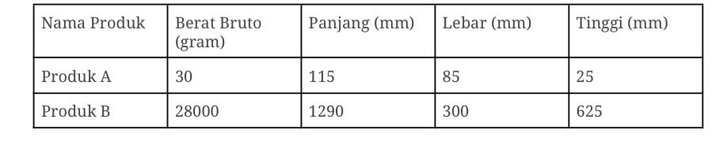

# als-test-pengetahuan-golang
1. Framework golang apa saja yang pernah anda pakai? Dan jelaskan secara singkat dengan framework tersebut project apa yang anda kerjakan dan mengapa menggunakan framework tersebut. 

    Jawab: 
    - Saya menggunakan framework gormmigarte untuk running sql migration. Saya menggunakan gormmigrate karena lebih mudah untuk manajemen perubahan table maupun data dan setiap perubahan dapat terrecord dengan baik pada table gorm_migration. Saya menggunakan framework tersebut pada project Nexchief2 dan Grochat.
    - Framework gorilla/mux untuk handle routing. Saya menggunakan gorilla/mux karena framework tersebut salah satu framework yang banyak digunakan untuk hanle routing dan penggunaanya juga cukup mudah. Saya menggunakan framework tersebut di project Nexchief2 dan Grochat.
    - Framework dgrr/fastws untuk handle websocket. Framework tersebut cukup lightweight untuk digunakan. Saya menggunakan framework tersebut pada project Grochat.


2. Jelaskan apa yang anda ketahui mengenai concurrency pada golang?

    Jawab:
    
    Concurrency pada golang adalah cara untuk menangani beberapa task atau job yang berjalan secara bersamaan (parallel). Concurrency di golang menggunakan goroutine atau dengan bantuan channle agar setiap goroutine dapat saling terhubung.


3. Buatlah contoh kode/function golang yang memanfaatkan antara WaitGroup dan Channel, dan jelaskan kapan bisa menggunakan waitgroup atau channel atau keduanya secara bersamaan.

    Jawab:
    
    
    Waitgroup tanpa channel digunakan untuk menjalankan task atau job tanpa perlu mengirim data antar goroutine dan hanya perlu menunggu setiap groroutine selesai.
    
    waitgroup.go
    ```go
    
    func main() {
        var wg sync.WaitGroup
        totalWorker := 5
    
        for i := 1; i <= totalWorker; i++ {
            wg.Add(1)
            go worker(i, &wg, ch)
        }
    
       
        wg.Wait()
    
    }
    
    func worker(id int, wg *sync.WaitGroup) {
        defer wg.Done()
    
        // do task here
    }
       
    ```
    
    Channel digunakan untuk menerima/mengirim data antar goroutine.
    
    channel.go
    ```go
    
    func worker(id int, ch chan<- string) {
        ch <- fmt.Sprintf("Worker %d selesai", id)
    }
    
    func main() {
        ch := make(chan string, 3) // buffered channel dengan kapasitas 3
    
        // Jalankan 3 goroutine
        go worker(1, ch)
        go worker(2, ch)
        go worker(3, ch)
    
        // Terima hasil dari 3 goroutine
        for i := 0; i < 3; i++ {
            msg := <-ch
            fmt.Println(msg)
        }
    
        fmt.Println("Semua worker selesai.")
    }
       
    ```
    
    
    Channel dan Waitgroup digunakan bersamaan saat menjalankan beberapa goroutine, mengirim datanya ke channel dan perlu tahu kapan semua task atau job selesai sehingga dapat close channel dengan aman.
    
    channel_waitgroup.go
    ```go
    
    func worker(id int, wg *sync.WaitGroup, resultChan chan<- string) {
        defer wg.Done()
    
        result := fmt.Sprintf("Worker %d selesai", id)
    
        // Kirim hasil ke channel
        resultChan <- result
    }
    
    func main() {
        var wg sync.WaitGroup
        resultChan := make(chan string, 5) // buffered channel
    
        totalWorker := 5
    
        // Jalankan semua worker
        for i := 1; i <= totalWorker; i++ {
            wg.Add(1)
            go worker(i, &wg, resultChan)
        }
    
        // Goroutine khusus untuk menutup channel saat semua worker selesai
        go func() {
            wg.Wait()
            close(resultChan)
        }()
    
        // Terima semua hasil dari channel
        for msg := range resultChan {
            fmt.Println(msg)
        }
    
        fmt.Println("Semua pekerjaan selesai.")
    }
    
    ```


4. Apa yang anda ketahui dengan goroutine? Pernahkah memakainya? Ceritakan jika pernah, jelaskan kegunaan dan tujuan nya dalam project yang pernah anda kerjakan.

    Jawab:

    Goroutine adalah fitur di golang untuk menjalankan banyak task dalam waktu yang bersamaan. Goroutine di golang running in background proccess. Saya pernah menggunakan goroutine beberapa kali. Salah satunya adalah ketika saya membuat scheduler untuk generate tiga data report dalam format .csv kemudian upload file tersebut ke FTP dan mengirim message email jika proses berhasil maupun ada error. Saya menggunakan tiga goroutine untuk menjalankan tiga job tersebut.

5. Jelaskan apa yang anda ketahui mengenai queueing pada golang, dan buat contoh kode sederhana.

    Jawab:

    Queue adalah struktur antrian data yang menggunakan pola first in first out ( FIFO ) dimana data yang masuk terlebih dahulu akan kelaur lebih dahulu juga. Berikut contoh konsep queue sedehana.

    queue.go
    ```go
    
    type Queue []string

    // Tambah data ke belakang (enqueue)
    func (q *Queue) Enqueue(item string) {
        *q = append(*q, item)
    }
    
    // Ambil data dari depan (dequeue)
    func (q *Queue) Dequeue() (string, bool) {
        if len(*q) == 0 {
            return "", false // queue kosong
        }
        item := (*q)[0]
        *q = (*q)[1:] // hapus elemen pertama
        return item, true
    }
    
    func main() {
        var q Queue

        // Tambah data ke queue
        q.Enqueue("Job A")
        q.Enqueue("Job B")
        q.Enqueue("Job C")

        // Ambil data dari queue
        for {
            item, ok := q.Dequeue()
            if !ok {
                break
            }
            fmt.Println("Proses:", item)
        }
    }
    
    ```
 
6. Dalam microservices yang semuanya menggunakan Go, bagaimana cara/metode terbaik masing2 service berkomunikasi satu sama lain?

    Jawab:

    Metode komunikasi antar service dalam sistem microservices ada beberapa cara, salah satu metode yang terbaik menurut saya dan pernah saya gunakan adalah dengan menggunakan rest API.
   
8. Buatlah contoh kode dalam Go, yang menggambarkan komunikasi antar service yang telah anda jelaskan diatas.

    Jawab:

    Misalkan service A memerlukan data profile user, maka service A perlu melakukan hit API ke Service Profile User yang mana service tersebut sudah provice API untuk get profile user.

    service_a.go
    ```go
    
    func fetchUserProfile(id int) (user UserProfile) {
        // Contoh client HTTP ke service lain
        resp, err := http.Get(fmt.Sprintf(`http://user-service:8080/users/%d`, id))

    }
    
    
    ```

9. Bagaimana anda mengatasi error dalam Go? Ceritakan pengalaman anda.

    Jawab:

    Di Golang error handling adalah bagian yang cukup penting. Go tidak memiliki try-catch seperti di javascript atau Java sehingga error ditangani dengan mengembalikan nilai error dari fungsi dan mengeceknya secara manual.


10. Apakah anda memiliki pengalaman dalam error logging dalam Go? Jika ya, jelaskan bagaimana anda menyimpan atau menampilkan setiap log agar mudah dikelola, terutama dalam microservices.

    Jawab:

    Biasanya saya menyimpan log error dalam format json di disimpan dalam file .txt. Log error biasanya menyimpan informasi seperti waktu timestamp, error message, location error code, request id dan sebagainya.

10. Buat kode dalam golang, untuk output perkiraan ongkos kirim suatu order jika diketahui:
    - Kurir bernama X Kargo, pengiriman dari Gudang A ke Kota B adalah Rp.10.000,- per kg
    - Data pesanan:
    

    Hal yang perlu diperhatikan:
    
        a. Function bisa dibuat dengan fungsi umum atau fungsi closure (named / unnamed function)
        b. Code yang dibuat harus bisa mengkalkulasi kondisi jumlah produk yang dinamis, contoh : Produk A quantity n, Produk B quantity m
        c. Penentuan atau kalkulasi berat suatu barang berdasarkan berat aktual dan volumetrik.


    Jawab:

    main.go
    ``` go

    / Struct produk
    type Produk struct {
        Nama          string
        BeratBruto    float64 // dalam gram
        PanjangMM     float64
        LebarMM       float64
        TinggiMM      float64
    }
    
    // Hitung berat dalam kg dari aktual dan volumetrik
    func hitungBeratEfektif(produk Produk, quantity int) float64 {
        beratAktual := produk.BeratBruto * float64(quantity) / 1000 // gram ke kg

        // Rumus volumetrik: (p * l * t) / 6000
        volumePerItem := (produk.PanjangMM * produk.LebarMM * produk.TinggiMM) / 6000
        beratVolumetrik := volumePerItem * float64(quantity) / 1000 // gram ke kg
    
        // Gunakan yang terbesar
        return math.Max(beratAktual, beratVolumetrik)
    }

    // Closure untuk kalkulasi ongkos kirim
    func kalkulatorOngkir(tarifPerKg float64) func([]Produk, map[string]int) float64 {
        return func(daftarProduk []Produk, qty map[string]int) float64 {
            var totalBerat float64
            for _, p := range daftarProduk {
                quantity := qty[p.Nama]
                if quantity > 0 {
                    berat := hitungBeratEfektif(p, quantity)
                    totalBerat += berat
                }
            }
            return totalBerat * tarifPerKg
        }
    }
    
    func main() {
        // Data produk
        produkList := []Produk{
            {"Produk A", 30, 115, 85, 25},
            {"Produk B", 28000, 1290, 300, 625},
        }

        // Jumlah pesanan
        quantityMap := map[string]int{
            "Produk A": 3, // contoh dinamis
            "Produk B": 1,
        }
    
        // Buat kalkulator ongkir untuk X Kargo
        tarifXKargo := 10000.0
        hitungOngkir := kalkulatorOngkir(tarifXKargo)
    
        ongkir := hitungOngkir(produkList, quantityMap)
        fmt.Printf("Total ongkos kirim: Rp%.0f,-\n", ongkir)
    }

    ```
    
12. Ceritakan kesulitan yang sering anda temui saat anda mengerjakan project dengan bahasa Go. Dan bagaimana anda mengatasi kesulitan tersebut.

    Jawab: 

    Di golang tidak ada try-catch sehingga harus secara manual hanle error dari suatu function, untuk menangani hal tersebut biasanya saya menggunkan helper function. Kesulitan lainnya adalah kesalahan konversi ```interface{}``` yang dapat menyebabkan panic, untuk menangani hal tersebut saya biasanya melakukan assertion dengan ```ok``` atau dengan menggunakan ```encoding/json```. Kesulitan lain adalah melakukan mock sql sehingga biasanya saya menggunakan library bantuan untuk mocking seperti DATA-DOG.

    
